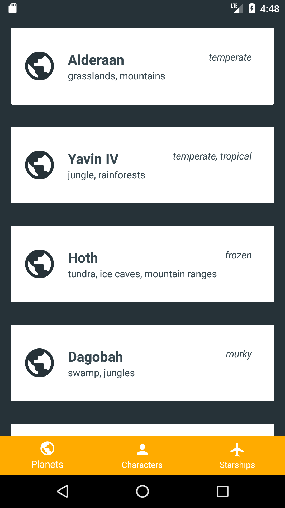

#  StarWarsMVP

Very simple Android MVP project using [*Retrofit*](http://square.github.io/retrofit/) to retrieve data from [*The Star Wars API*](https://swapi.co/), and showing how to use BottomNavigationView.

)
